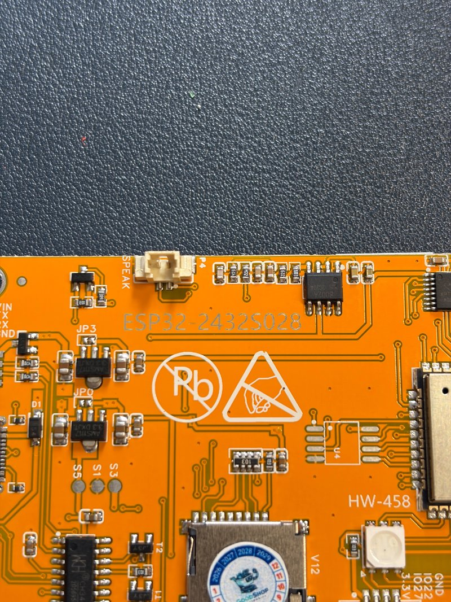
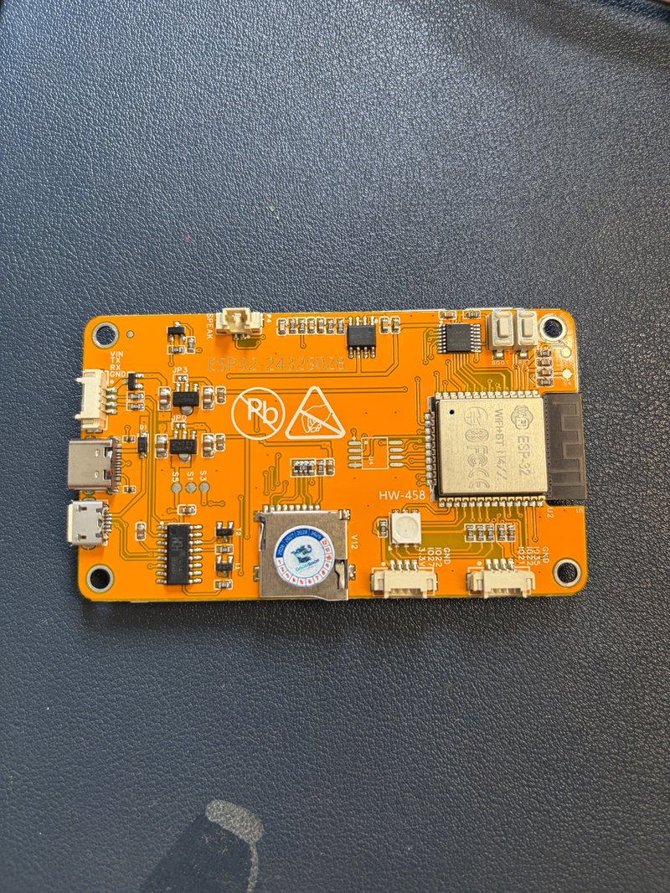
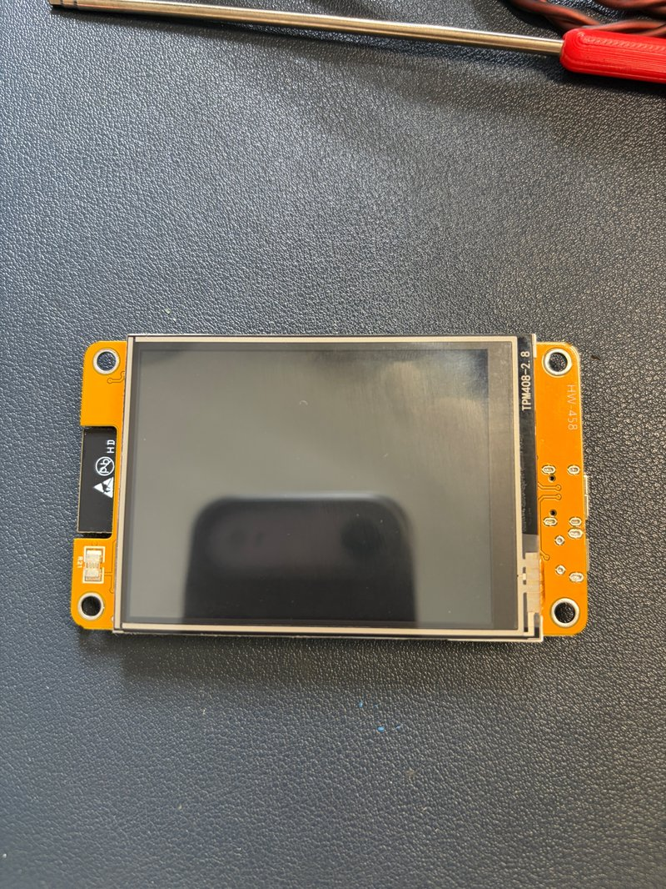
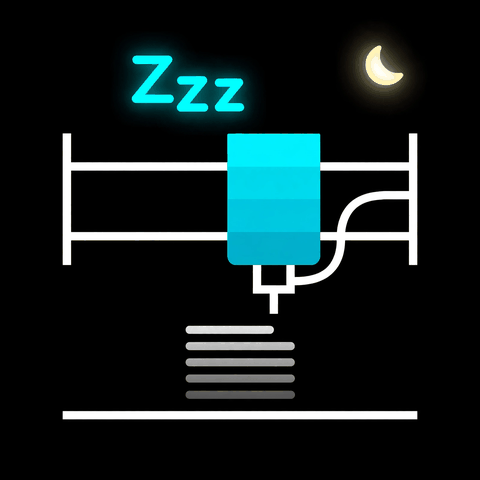
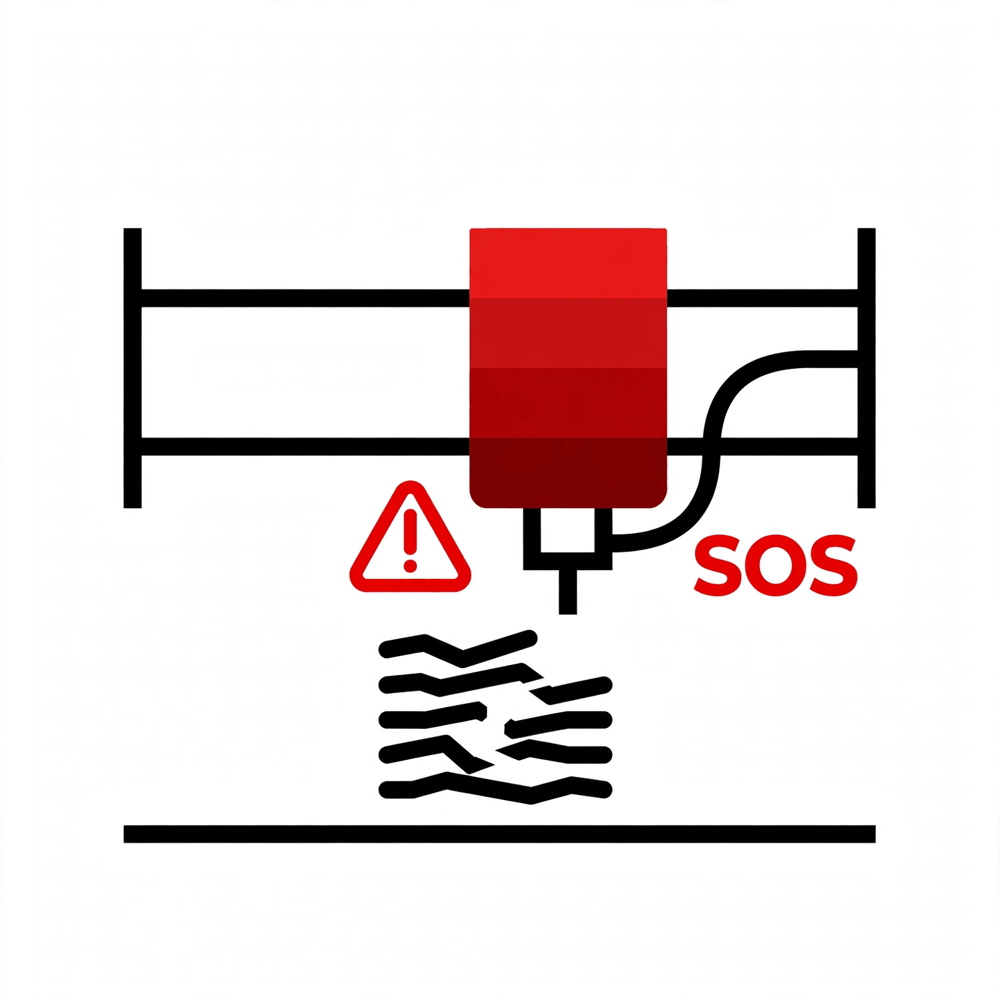
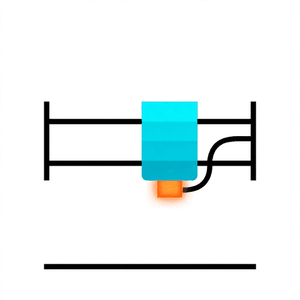
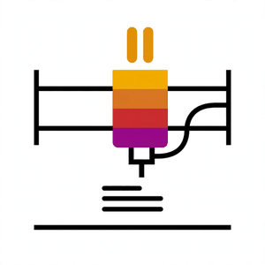
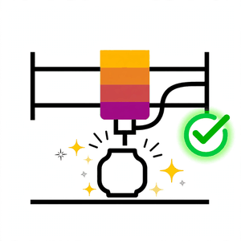

# 🖨️ SnapDaddy

Custom Klipper display firmware for the Snapmaker U1 — based on [CYD-Klipper](https://github.com/printorems/cyd-klipper), reworked with a portrait UI, animated status screens, and one-tap printing.

If you like this project, consider [☕ buying me a coffee](https://buymeacoffee.com/khuongka). Questions or feature requests? Open an issue — happy to help.

> **📩 Need custom firmware or have any questions? Contact me on WhatsApp: `wallenme`**

## Hardware requirements

- **Display:** CYD 2.8" — ESP32-2432S028R (no PSRAM variant)
- **Printer:** Snapmaker U1 running Klipper + Moonraker (port `7125`)
- **Network:** 2.4 GHz Wi-Fi (display and printer on the same network)
- **Slicer:** OrcaSlicer / Snapmaker Orca with `32x32` thumbnails enabled for preview images

| Front | Back | Detail |
|---|---|---|
|  |  |  |

## How it works

The display connects to Moonraker over Wi-Fi and mirrors the printer's state in real time. The screen automatically switches illustration and layout per state:

| State | Preview | Description |
|---|---|---|
| **Idle / Ready** |  | Dark sleeping screen with a calm moon animation. Tap **START** to browse `.gcode` files stored on the printer — each with its thumbnail — then confirm to print. |
| **Printing** |  | Animated printer illustration, live progress bar, current/total layer, remaining time, and temperatures for all 4 hotends, bed, and chamber. The active hotend's dot blinks. **Pause/Resume** and **Stop** buttons included. |
| **Error** |  | Red alert animation with the printer's error message, so you notice a failed print at a glance. |
| **Preparing** 🆕 |  | Heating animation while the printer warms up the hotend and bed before printing starts. |
| **Paused** 🆕 |  | Dedicated pause animation. Tap **Resume** to continue (with confirmation). |
| **Complete** 🆕 |  | Celebration animation when a print finishes. Returns to idle automatically after 15 minutes. |

## Flash the firmware

Flash directly from your browser (Chrome/Edge) — no software to install:

👉 **[Flash via khuong.cloud](https://khuong.cloud/cyd-flash/)**

Steps:
1. Connect the CYD display to your computer via USB.
2. Click **Install** and pick the display's serial port.
3. Wait 1–2 minutes, then let the display reboot.
4. After boot, **hold BOOT for 8 seconds** and touch the two calibration points to calibrate the touchscreen.

> ⚠️ **First-time install:** this build uses the `min_spiffs` partition layout. If coming from a different firmware, tick **"Erase device"** before installing. Saved Wi-Fi credentials may be erased — re-enter them after flashing.

## Building from source

Requires [PlatformIO](https://platformio.org/):

```bash
git clone https://github.com/khuonguyenhcm-bit/CYD-U1.git
cd CYD-U1
# Open in VS Code with the PlatformIO extension, then Build + Upload
# Board auto-enters download mode — no need to hold BOOT during upload
```

## Version History

### v1.2
- **Auto-scan printer**: if the display can't reach the printer for 3 minutes, it automatically scans your WiFi network for Moonraker (port 7125) and reconnects — no need to know the printer's IP
- **Find Printer button**: tap to scan immediately instead of waiting
- Scan retries 2 times, then waits 3 minutes and repeats until connected

### v1.1
- New **Preparing** state: heating animation while the printer warms up before printing
- New **Complete** state: celebration animation when a print finishes (auto-returns to idle after 15 min)
- New **Paused** state: dedicated pause animation
- **Pause/Stop confirmation**: tap Pause or Stop now asks for confirmation before acting
- All status animations enlarged by 10%

### v1.0
- Initial public release: portrait UI, animated Idle/Printing/Error screens, file browser with thumbnails, print confirmation, 4-hotend + chamber temps

## License

Based on [CYD-Klipper](https://github.com/printorems/cyd-klipper). Custom UI by khuong nguyen.
